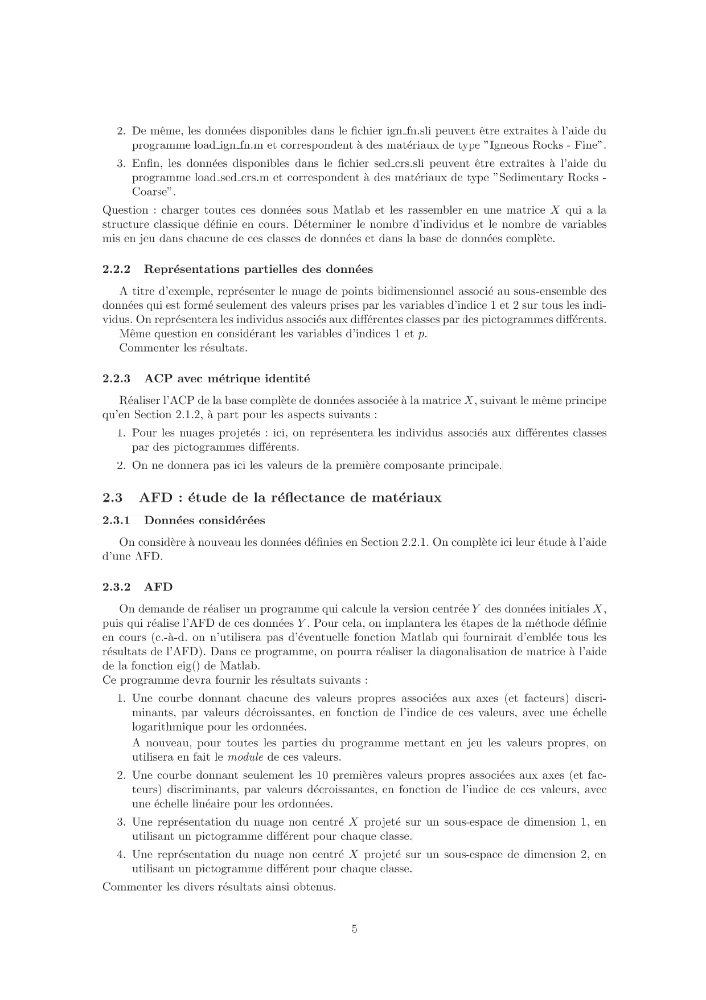
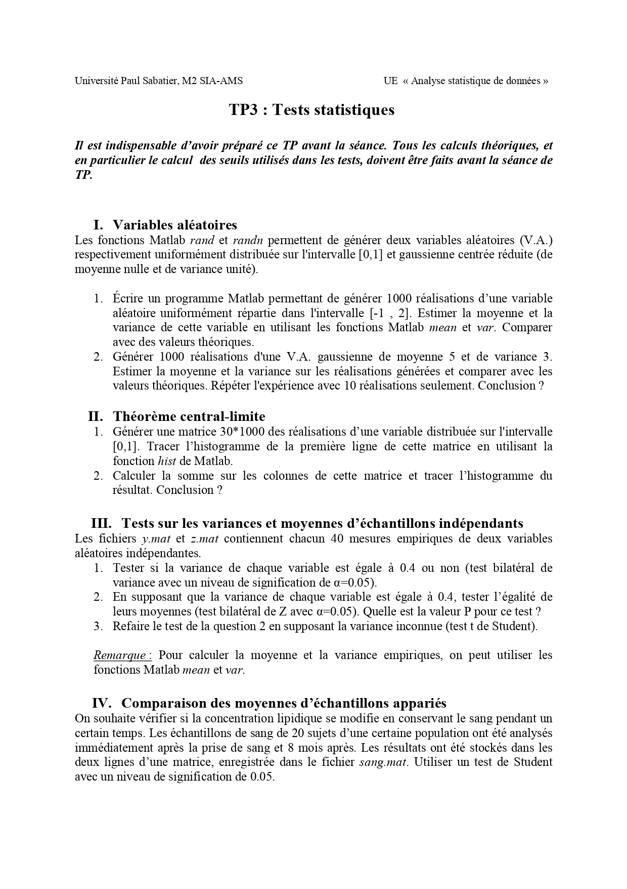
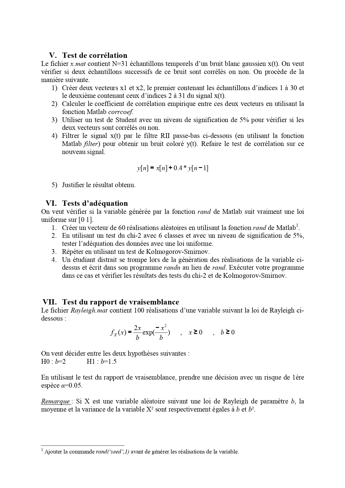

#  TP – ACP (Analyse en composantes principales) & AFD (Analyse factorielle discriminante)

**Université Paul Sabatier – M2 SIA (Audio-Vidéo)**  
Module : Analyse statistique de données  
Encadrant : Mr. Shahram HOSSEINI  

---

##  Objectif du TP

L’objectif de ce TP est d’analyser des données en utilisant :
- **ACP (PCA)** : réduire la dimension et visualiser les données.
- **AFD (LDA)** : trouver des axes qui séparent mieux les classes.

---

##  Partie I – ACP (Analyse en composantes principales)

### Principe
L’ACP transforme les variables d’origine en nouvelles variables (composantes principales) qui :
- gardent un maximum d’information (variance),
- permettent de travailler dans un espace de dimension plus faible (ex : 1D ou 2D).

### Étapes réalisées
- Calcul des **valeurs propres** (importance des composantes).
- Tracé des **10 premières valeurs propres**.
- Tracé du **pourcentage d’inertie expliquée** (pour choisir la dimension).
- Projection des données en **1D** puis **2D** pour visualiser les classes.

### Résultat (idée générale)
Les premières composantes expliquent la majorité de l’information.  
La projection en 2D est plus informative que 1D pour visualiser la structure des données.

---

##  Partie II – AFD (Analyse factorielle discriminante)

### Principe
L’AFD cherche des axes qui :
- **séparent au mieux les classes**,
- maximisent la séparation entre classes par rapport à la dispersion dans chaque classe.

### Étapes réalisées
- Calcul des **valeurs propres discriminantes**.
- Tracé des **10 premières valeurs propres**.
- Projection des données sur les **axes discriminants** (1D puis 2D).

### Résultat (idée générale)
Les premiers axes discriminants contiennent l’essentiel de l’information utile pour séparer les classes.  
La projection en 2D améliore la séparation par rapport à 1D.

---

##  Conclusion

Ce TP montre que :
- l’**ACP** est utile pour réduire la dimension et visualiser les données, mais ne garantit pas une séparation parfaite des classes.
- l’**AFD** est plus adaptée pour la **classification**, car elle cherche directement à séparer les classes.

---

##  Contenu du dépôt

- Script Matlab du TP (`Code.m`)
- Compte rendu PDF (`Compre_rendu.pdf`)
- Base de données fournie pour l’analyse statistique (`X.mat`)
- Énoncé du TP 

---

##  Énoncé du TP (Sujet 2)

  

  

  

  

---

TP réalisé dans le cadre du cours encadré par **Mr. Shahram HOSSEINI**  
Université Paul Sabatier – Toulouse
