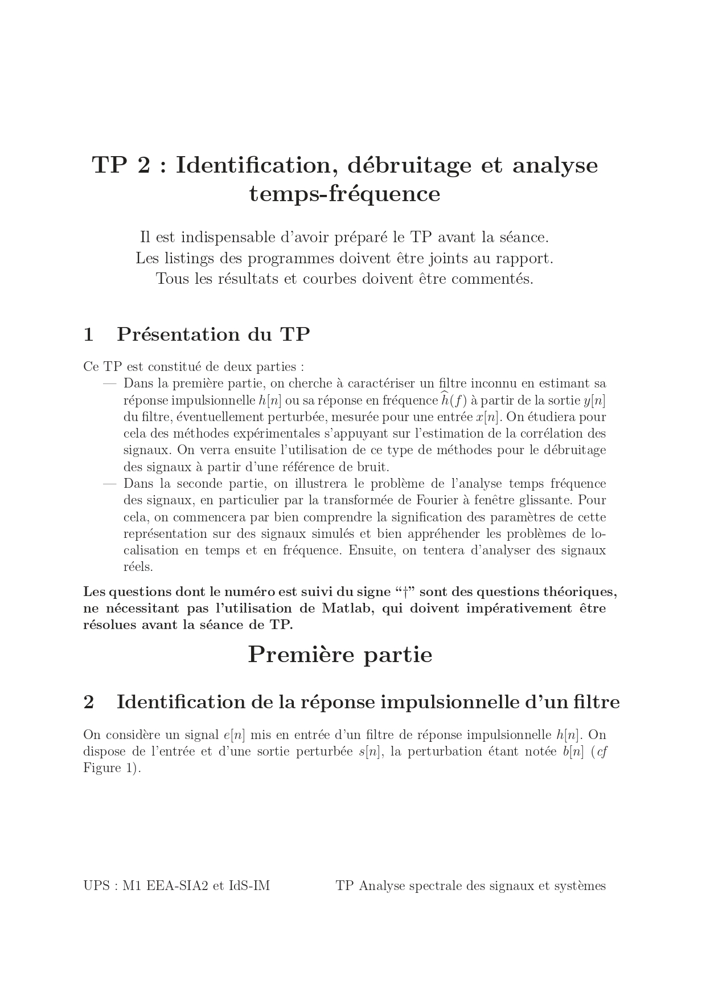
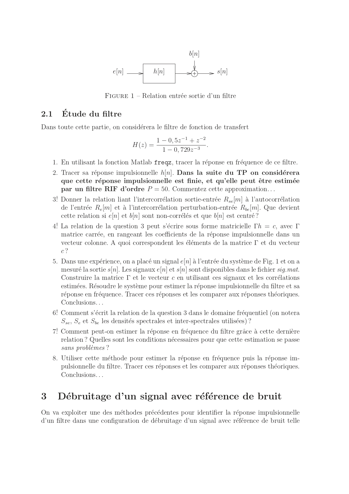
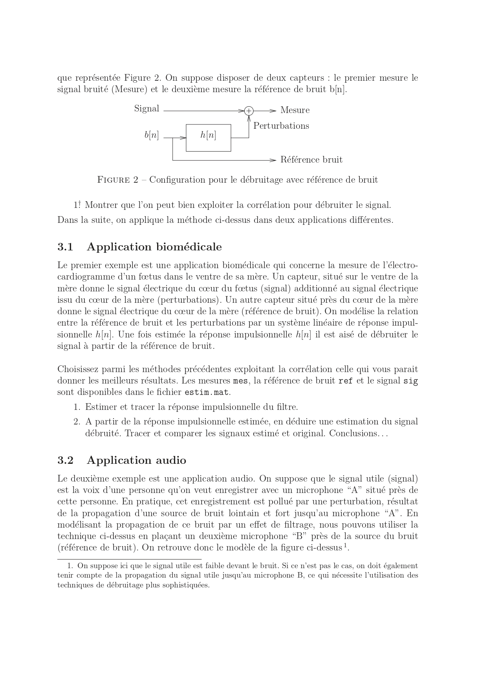
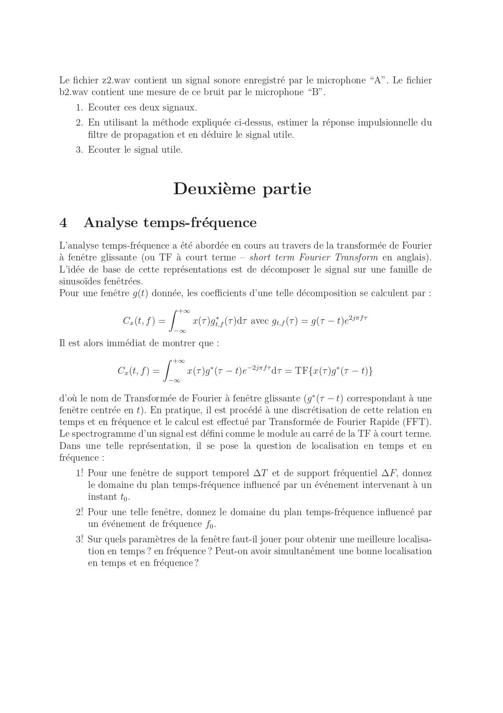
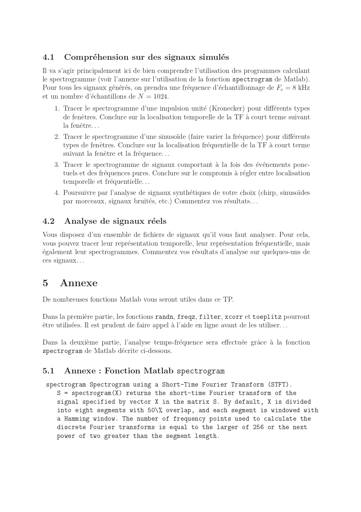
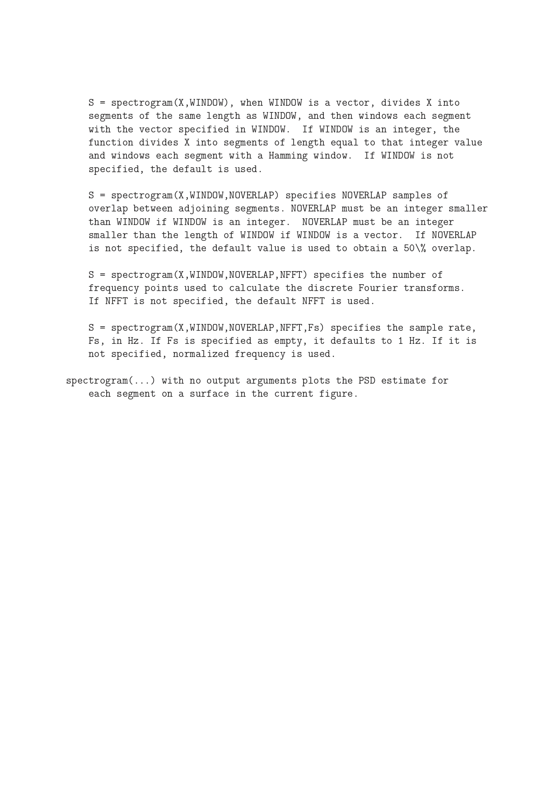

#  TP 2 – Identification, Denoising & Time-Frequency Analysis

**Titre complet :** Identification, débruitage et analyse temps-fréquence  
Université Paul Sabatier – M1 EEA-SIA2 / IdS-IM  
Encadrant : Mr. Shahram HOSSEINI  

---

##  Objectif du TP

Ce TP a pour objectif d’étudier :

-  L’identification d’un filtre à partir de signaux mesurés
-  Le débruitage avec référence de bruit
-  L’analyse temps-fréquence via la STFT (spectrogramme)

Il combine des outils de corrélation, d’analyse fréquentielle et de traitement audio.

---

#  I – Identification d’un filtre

Nous avons étudié un système défini par une fonction de transfert donnée.

### Étapes réalisées :

- Calcul et tracé de la réponse fréquentielle (fonction `freqz`)
- Calcul et tracé de la réponse impulsionnelle
- Approximation par un filtre RIF d’ordre fini
- Estimation via les corrélations entrée-sortie
- Résolution matricielle pour estimer la réponse impulsionnelle

### Résultat

La réponse estimée est proche de la réponse théorique.  
L’approximation par un filtre RIF d’ordre 50 donne de bons résultats.

---

#  II – Débruitage avec référence de bruit

Configuration à deux capteurs :

- Micro A : signal bruité
- Micro B : référence de bruit

### Méthode :

- Estimation de la réponse impulsionnelle du filtre de propagation
- Exploitation des corrélations
- Soustraction du bruit estimé

---

##  Application biomédicale

Objectif : extraire le signal cardiaque fœtal à partir d’un signal bruité.

- Estimation de la réponse impulsionnelle
- Reconstruction du signal utile
- Comparaison signal estimé / original

---

##  Application audio

Fichiers audio fournis (.wav)

- Écoute des signaux
- Estimation du filtre
- Reconstruction du signal utile
- Validation par écoute

---

#  III – Analyse temps-fréquence

Étude du spectrogramme (STFT) :

- Influence de la fenêtre
- Compromis temps / fréquence
- Localisation temporelle et fréquentielle
- Étude de signaux simulés
- Analyse de signaux réels

### Observation clé :

Il existe un compromis fondamental :
- Bonne résolution temporelle ⟷ Mauvaise résolution fréquentielle
- Bonne résolution fréquentielle ⟷ Mauvaise résolution temporelle

---

#  Conclusion

Ce TP montre que :

- Les corrélations permettent d’identifier un filtre inconnu.
- Le débruitage avec référence de bruit est efficace lorsque les signaux sont corrélés.
- L’analyse temps-fréquence nécessite un compromis entre précision temporelle et fréquentielle.
- Le spectrogramme est un outil puissant pour analyser des signaux réels.

---

##  Contenu du dépôt

- `CODE.m` → Script principal Matlab
- `Compte_rendu_TP2.pdf` → Rapport détaillé
- 2 fichiers `.mat` → Données expérimentales
- 7 fichiers `.wav` → Signaux audio utilisés
- Images de l’énoncé (pages 0005 à 0010)

---

## 📑 Énoncé du TP

  

  

  

  

  

  

---

TP réalisé dans le cadre du cours encadré par **Mr. Shahram HOSSEINI**  
Université Paul Sabatier – Toulouse
