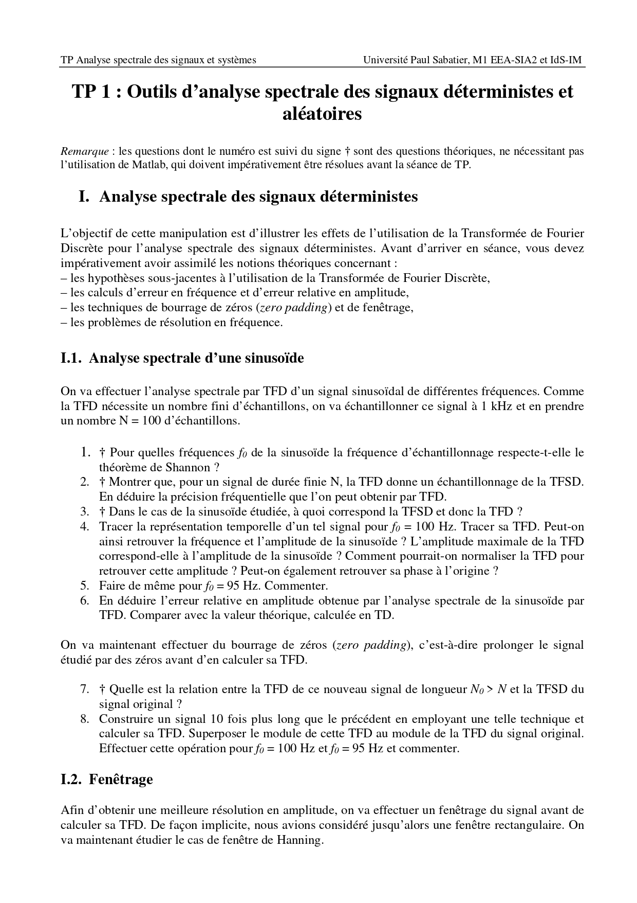
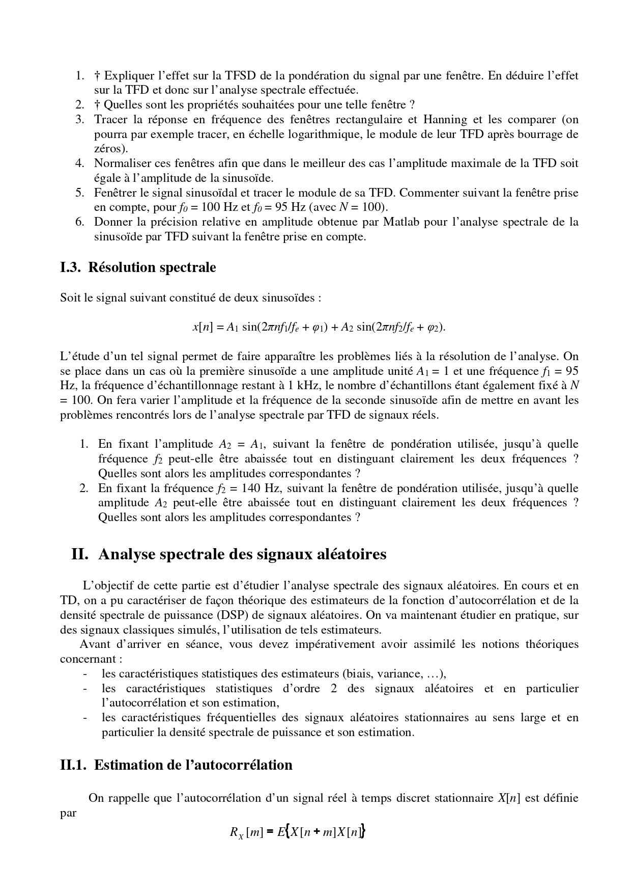
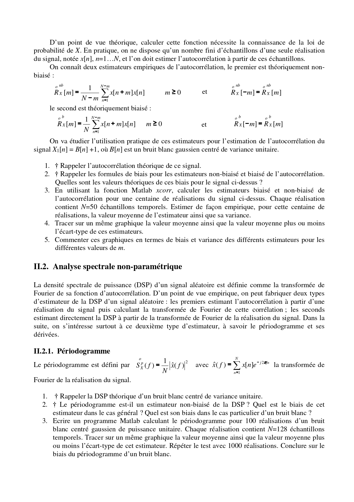
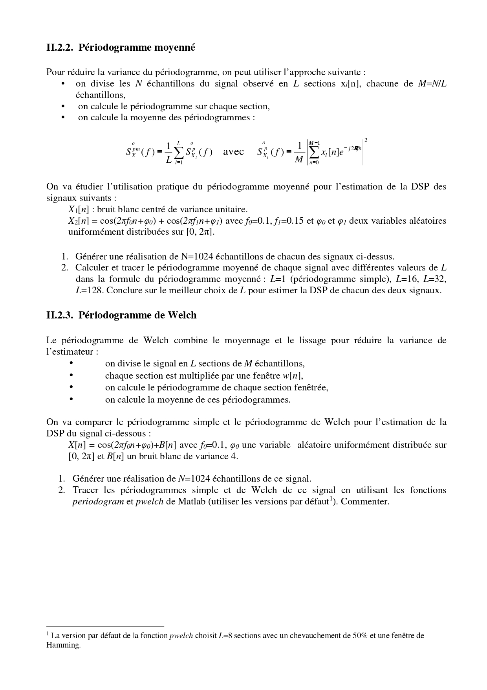

#  TP 1 – Spectral Analysis Tools

**Titre complet :** Outils d’analyse spectrale des signaux déterministes et aléatoires  
Université Paul Sabatier – M1 EEA-SIA2 / IdS-IM  
Encadrant : Mr. Shahram HOSSEINI  

---

##  Objectif du TP

Ce TP a pour objectif d’étudier les outils d’analyse spectrale appliqués :

- aux signaux déterministes (sinusoïdes),
- aux signaux aléatoires (bruit blanc, signaux bruités).

L’objectif est de comprendre :
- la Transformée de Fourier Discrète (TFD),
- la résolution fréquentielle,
- l’erreur en amplitude,
- le fenêtrage,
- l’estimation de la densité spectrale de puissance (DSP).

---

#  I – Analyse spectrale des signaux déterministes

##  Préparation théorique

Avant la séance, nous avons étudié :

- Le théorème de Shannon  
- La relation entre TFD et TFSD  
- La précision fréquentielle :  
  Δf = Fe / N  
- L’effet du zero padding  
- L’effet du fenêtrage (rectangulaire vs Hanning)

---

##  Résultats principaux

- Si la fréquence correspond exactement à un multiple de Fe/N, l’estimation est précise.
- Sinon, on observe un étalement spectral.
- Le zero padding améliore la visualisation mais pas la résolution réelle.
- La fenêtre de Hanning réduit les lobes secondaires mais élargit le lobe principal.

---

#  II – Analyse spectrale des signaux aléatoires

##  Estimation de l’autocorrélation

Étude de :
- Estimateur biaisé
- Estimateur non biaisé
- Moyenne empirique
- Variance

Observation :
L’estimateur biaisé présente une variance plus faible.

---

##  Estimation de la DSP

Nous avons étudié :

- Le périodogramme simple
- Le périodogramme moyenné
- La méthode de Welch

Conclusion :
La méthode de Welch offre un bon compromis entre résolution fréquentielle et réduction de variance.

---

#  Conclusion générale

Ce TP montre que :

- La résolution fréquentielle dépend directement de Fe et N.
- Le fenêtrage influence fortement la qualité du spectre.
- Le périodogramme simple est très bruité.
- Les méthodes de moyennage améliorent la stabilité de l’estimation.

L’analyse spectrale nécessite toujours un compromis entre résolution et variance.

---

##  Contenu du dépôt

- `Code_KABOU.m` → Script principal Matlab
- `Compte_rendu_TP1.pdf` → Compte rendu détaillé
- Images de l’énoncé (pages 0001 à 0004)
- Notes de préparation théorique

---

##  Énoncé du TP

  

  

  

  

---

TP réalisé dans le cadre du cours encadré par **Mr. Shahram HOSSEINI**  
Université Paul Sabatier – Toulouse
