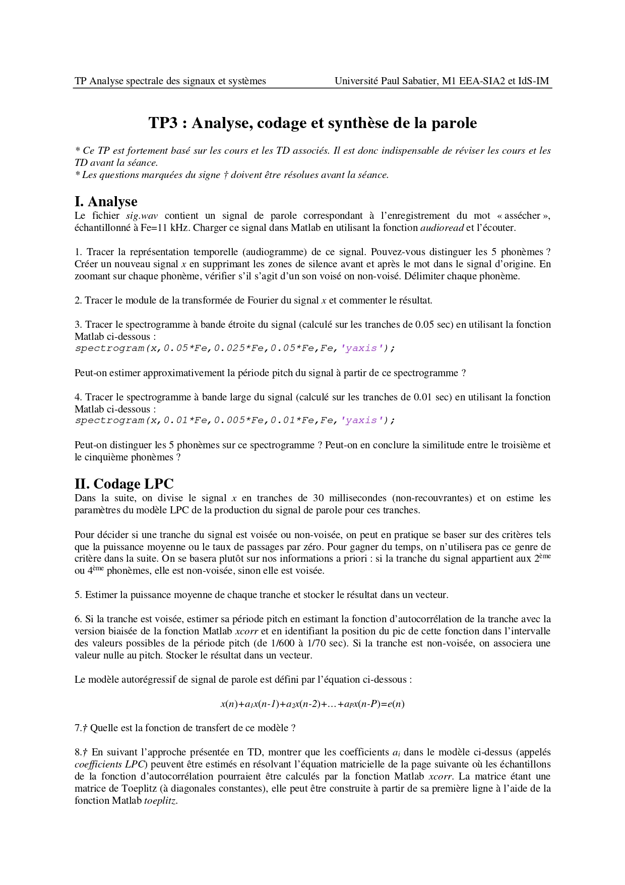
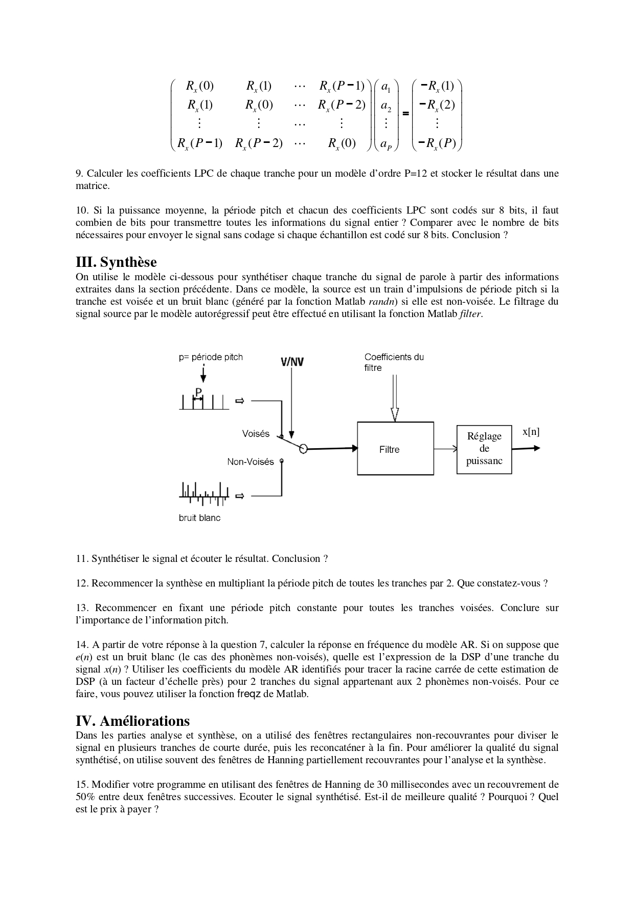
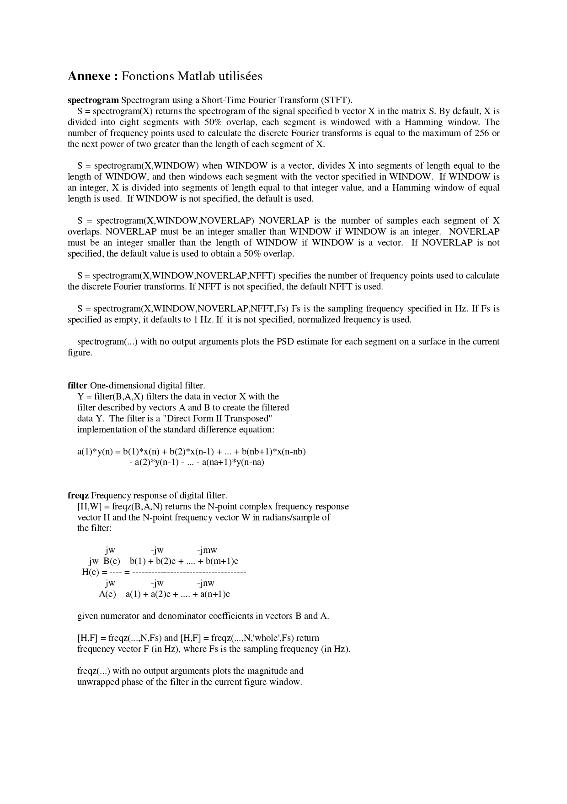

#  TP3 – Speech Analysis, LPC Coding & Synthesis

**Titre complet :** Analyse, codage et synthèse de la parole  
Université Paul Sabatier – M1 EEA-SIA2 / IdS-IM  
Encadrant : Mr. Shahram HOSSEINI  

---

##  Objectif du TP

Ce TP a pour objectif d’étudier un signal de parole et de :

-  Analyser ses caractéristiques temporelles et fréquentielles
-  Extraire les paramètres du modèle LPC
-  Synthétiser le signal à partir du modèle autoregressif
-  Étudier l’impact du pitch et du fenêtrage

Le signal étudié est le fichier :

`sig.wav` (mot enregistré, Fe = 11 kHz)

---

#  I – Analyse du signal de parole

### Étapes réalisées :

- Tracé du signal temporel (audiogramme)
- Suppression des silences
- Découpage en phonèmes
- Identification sons voisés / non-voisés
- Calcul du module de la FFT
- Spectrogramme bande étroite (estimation du pitch)
- Spectrogramme bande large (localisation temporelle)

### Observations :

- Les sons voisés présentent une structure harmonique claire.
- Les sons non-voisés ont un spectre large bande.
- Le spectrogramme bande étroite permet d’estimer la période pitch.
- Le spectrogramme bande large améliore la localisation temporelle.

---

#  II – Codage LPC

Le signal est découpé en tranches de 30 ms.

Pour chaque tranche :

1. Estimation de la puissance moyenne
2. Détection voisé / non-voisé
3. Estimation de la période pitch via autocorrélation
4. Calcul des coefficients LPC (ordre P = 12)
5. Stockage des paramètres

### Modèle AR utilisé :

x(n) + a₁x(n−1) + ... + aₚx(n−P) = e(n)

### Résultat :

Le modèle LPC permet de capturer la structure spectrale du conduit vocal.

---

#  III – Synthèse du signal

Le signal est reconstruit à partir :

-  Des coefficients LPC
-  De la puissance moyenne
-  Du pitch
-  D’une source :
  - Train d’impulsions (voisé)
  - Bruit blanc (non-voisé)

### Expériences réalisées :

- Synthèse normale
- Doublement de la période pitch
- Pitch constant pour toutes les tranches

### Observations :

- Doubler le pitch rend la voix plus grave.
- Pitch constant réduit l’intelligibilité.
- Le pitch est essentiel pour la naturalité de la parole.

---

#  IV – Amélioration par fenêtrage

Utilisation de :

- Fenêtre de Hanning
- Recouvrement 50%

### Résultat :

- Amélioration de la qualité perceptive
- Réduction des discontinuités
- Meilleure transition entre tranches

Prix à payer :
- Complexité plus élevée
- Temps de calcul supérieur

---

#  Conclusion

Ce TP montre que :

- Le modèle LPC capture efficacement l’enveloppe spectrale.
- Le pitch est une information cruciale pour la synthèse.
- La séparation voisé / non-voisé est essentielle.
- Le fenêtrage améliore significativement la qualité du signal synthétisé.

Ce TP illustre les bases du codage paramétrique de la parole.

---

##  Contenu du dépôt

- `CODE.m` → Script Matlab
- `Compte_rendu_TP3.pdf` → Rapport détaillé
- `sig.wav` → Signal de parole étudié
- Images de l’énoncé

---

##  Énoncé du TP

  

  

  

---

TP réalisé dans le cadre du cours encadré par **Mr. Shahram HOSSEINI**  
Université Paul Sabatier – Toulouse
