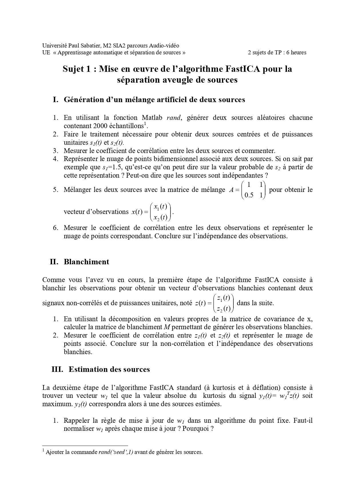
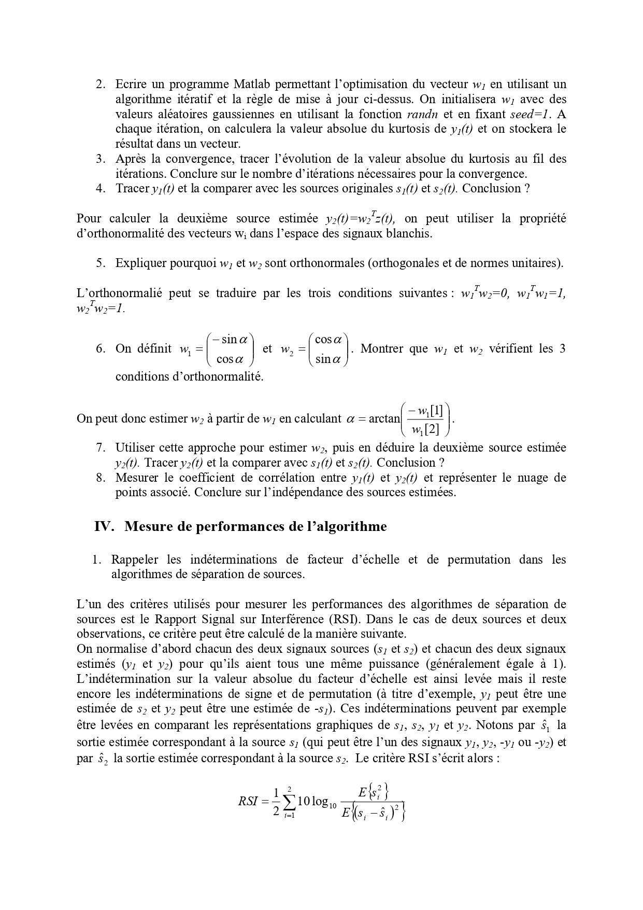
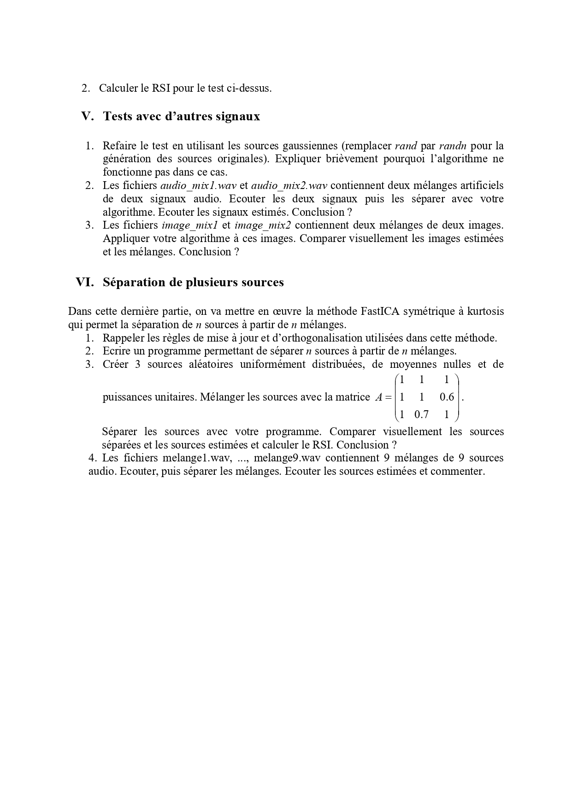

#  TP1 – Blind Source Separation with FastICA

**Titre complet :** Mise en œuvre de l’algorithme FastICA pour la séparation aveugle de sources  
Université Paul Sabatier – M2 SIA (Audio-Vidéo)  
UE : Apprentissage automatique et séparation de sources  

---

##  Objectif du TP

Ce TP a pour objectif de mettre en œuvre l’algorithme **FastICA** afin de séparer des sources indépendantes à partir de mélanges observés.

Applications étudiées :

-  Mélange artificiel de deux sources
-  Séparation de signaux audio
-  Séparation d’images
-  Séparation de 9 sources audio

---

#  I – Génération d’un mélange artificiel

### Étapes :

1. Génération de deux sources aléatoires
2. Centrage et normalisation (puissance unitaire)
3. Mélange via matrice de mélange A
4. Analyse corrélation des sources et des observations

Observation :  
Les sources sont indépendantes mais les observations sont corrélées.

---

#  II – Blanchiment

- Calcul de la matrice de covariance
- Décomposition en valeurs propres
- Construction de la matrice de blanchiment
- Vérification : observations blanchies non corrélées

Le blanchiment simplifie la séparation en réduisant le problème à une rotation.

---

#  III – Estimation des sources (FastICA)

Algorithme utilisé :

- Maximisation de la valeur absolue du kurtosis
- Mise à jour itérative du vecteur w
- Normalisation à chaque itération
- Orthogonalisation pour estimer plusieurs sources

Implémentations :

- `Code_TP1_KABOU.m`
- `fastica_sym_kurtosis.m` (version symétrique)

---

##  Critère de performance

Mesure utilisée : **RSI (Rapport Signal sur Interférence)**

Permet d’évaluer la qualité de séparation.

Résultat :
RSI élevé → bonne séparation.

---

#  IV – Tests avec d’autres signaux

##  Séparation audio

Fichiers utilisés :

- 2 mélanges audio artificiels
- 9 mélanges audio (melange1.wav → melange9.wav)

Étapes :

- Écoute des mélanges
- Application de FastICA
- Écoute des sources estimées

Conclusion :
La séparation est satisfaisante lorsque les sources sont non gaussiennes et statistiquement indépendantes.

---

##  Séparation d’images

Fichiers :

- `image_mix1.bmp`
- `image_mix2.bmp`

Résultat :

Les images originales sont correctement séparées (à permutation et facteur d’échelle près).

---

#  V – Séparation de plusieurs sources

Implémentation de la version **FastICA symétrique** pour séparer n sources :

- Génération de 3 sources artificielles
- Mélange via matrice A
- Séparation simultanée
- Calcul du RSI

Extension :

Séparation de 9 sources audio à partir de 9 mélanges.

---

#  Conclusions

Ce TP montre que :

- L’indépendance statistique permet la séparation aveugle.
- Le blanchiment est une étape essentielle.
- Le kurtosis est un bon critère de non-gaussianité.
- L’algorithme ne fonctionne pas pour des sources gaussiennes.
- FastICA symétrique permet la séparation multi-sources.

Les indéterminations restantes :
- Facteur d’échelle
- Permutation
- Signe

---

#  Contenu du dépôt

- `Code_TP1_KABOU.m` → Script principal
- `fastica_sym_kurtosis.m` → Implémentation symétrique
- `Compte rendu TP1.pdf` → Rapport détaillé
- 2 fichiers audio mélangés
- 2 images mélangées
- 9 fichiers `melangeX.wav`

---

#  Énoncé du TP

  

  

  

---

TP réalisé dans le cadre du cours  
**Apprentissage automatique et séparation de sources**  
Université Paul Sabatier – Toulouse
