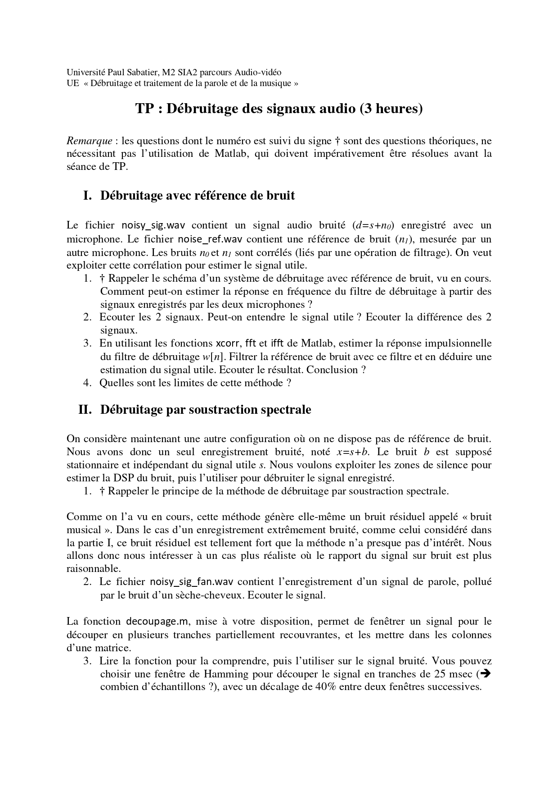
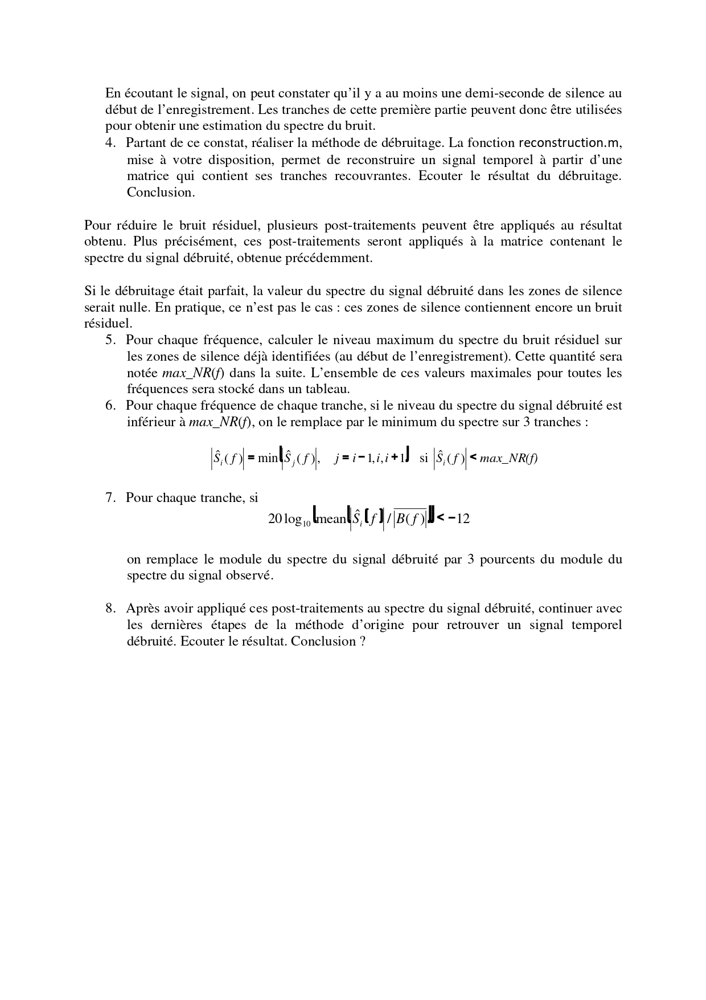

#  TP – Débruitage des Signaux Audio

**Université Paul Sabatier – M2 SIA (Audio-Vidéo)**  
UE : Débruitage et traitement de la parole et de la musique  
Encadrant : Mr. Shahram HOSSEINI  

---

##  Objectif du TP

L’objectif de ce TP est d’étudier et d’implémenter deux méthodes de débruitage audio afin d’améliorer la qualité d’un signal de parole bruité.

---

##  Partie I – Débruitage avec référence de bruit

### Principe
On dispose de deux signaux :
- `noisy_sig.wav` : signal bruité (s + n₀)
- `noise_ref.wav` : référence du bruit (n₁)

Les deux bruits étant corrélés, on estime un filtre permettant d’approcher le bruit présent dans le signal principal à partir du bruit de référence.

### Étapes réalisées
- Calcul des corrélations
- Estimation du filtre de débruitage
- Filtrage de la référence
- Soustraction du bruit estimé
- Écoute du signal débruité

### Résultat
Après filtrage, la phrase :
> "Si vous avez bien filtré, vous devriez m’entendre"
devient audible.

La méthode fonctionne bien si le bruit de référence est fortement corrélé avec le bruit principal. Sinon, des distorsions peuvent apparaître.

---

##  Partie II – Débruitage par soustraction spectrale

### Principe
On ne dispose que d’un seul signal bruité :
- `noisy_sig_fan.wav`

On utilise les premières 0.5 secondes (silence) pour estimer le spectre moyen du bruit.

### Étapes réalisées
1. Découpage en tranches de 25 ms (fenêtre de Hamming)
2. Estimation du spectre moyen du bruit
3. Soustraction spectrale
4. Reconstruction temporelle
5. Post-traitements pour réduire le bruit musical :
   - Seuil basé sur le bruit résiduel
   - Lissage sur 3 tranches
   - Remplacement par 3% du spectre observé si nécessaire
6. Reconstruction finale du signal

### Résultat
Le souffle est réduit et la parole devient plus claire.  
Les post-traitements améliorent la qualité du signal et réduisent le bruit musical, même si un léger bruit peut subsister.

---

##  Conclusion

Dans ce TP, nous avons implémenté deux méthodes de débruitage audio.  
La méthode avec référence est efficace lorsque les hypothèses sont respectées.  
La soustraction spectrale permet de réduire le bruit sans référence externe mais peut générer des artefacts.  
Les post-traitements améliorent la qualité perceptive du signal final.

---

##  Contenu du dépôt

- Script Matlab du TP  
- Fichiers audio utilisés  
- Compte rendu PDF  
- Énoncé du TP  

---

## 📑 Énoncé du TP

  

  

---

TP réalisé dans le cadre du cours encadré par **Mr. Shahram HOSSEINI**  
Université Paul Sabatier – Toulouse
