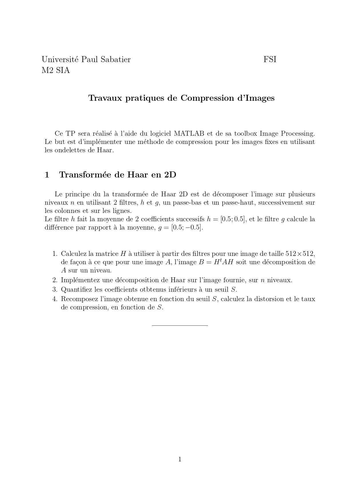

#  TP – Compression d’Images par Transformée de Haar 2D

Université Paul Sabatier – M2 SIA  
UE : Compression d’Images  
Logiciel utilisé : MATLAB (Image Processing Toolbox)

---

##  Objectif du TP

L’objectif de ce TP est d’implémenter une méthode de **compression d’image** basée sur la **transformée en ondelettes de Haar 2D**.

Le principe est de :

1. Décomposer l’image sur plusieurs niveaux.
2. Appliquer un seuillage des coefficients.
3. Reconstruire l’image compressée.
4. Évaluer la distorsion et le taux de compression.

---

##  Transformée de Haar 2D

### Principe

La transformée de Haar repose sur deux filtres :

- Filtre passe-bas :  
  \[
  h = [0.5 \quad 0.5]
  \]

- Filtre passe-haut :  
  \[
  g = [0.5 \quad -0.5]
  \]

La décomposition est effectuée successivement :

- sur les **lignes**
- puis sur les **colonnes**

Pour une image \( A \), la décomposition sur un niveau s’écrit :

\[
B = H^T A H
\]

où \( H \) est la matrice de Haar construite pour une image 512×512.

---

##  Image utilisée

Image fournie :

  

---

##  Étapes réalisées

###  Construction de la matrice de Haar

- Construction de la matrice \( H \) adaptée à une image 512×512
- Vérification de la propriété d’orthogonalité

---

###  Décomposition multi-niveaux

- Implémentation de la transformée de Haar sur **n niveaux**
- Séparation des sous-bandes :
  - Approximation (LL)
  - Détails horizontaux (LH)
  - Détails verticaux (HL)
  - Détails diagonaux (HH)

---

###  Seuillage des coefficients

- Application d’un seuil \( S \)
- Mise à zéro des coefficients de faible amplitude
- Compression basée sur la parcimonie des coefficients

---

### Reconstruction

- Reconstruction de l’image compressée
- Calcul des performances :

#### Distorsion (RMSE)

RMSE = sqrt( (1/N) * sum_{k=1..N} (A_k - Ahat_k)^2 )

#### Taux de compression (CR)

CR = (nombre total de coefficients) / (nombre de coefficients conservés)

---

##  Analyse des résultats

- Plus le seuil \( S \) augmente :
  - plus le nombre de coefficients conservés diminue
  - plus le taux de compression augmente
  - mais la distorsion augmente également

On observe un compromis classique :

 **Compression élevée ↔ perte de qualité**

La transformée de Haar permet une représentation parcimonieuse efficace pour la compression d’images naturelles.

---

##  Contenu du dépôt

- `CODE_TP_KABOU.m` → Script MATLAB complet
- `Compte rendu TP1.pdf` → Rapport détaillé
- `buttress.jpg` → Image utilisée
- `tp_compression_page-0001.jpg` → Énoncé du TP

---

##  Énoncé du TP

  

---

##  Conclusion

La transformée de Haar 2D constitue une méthode simple et efficace de compression :

- Bonne concentration d’énergie dans les basses fréquences
- Structure multi-résolution
- Implémentation simple
- Bon compromis qualité / compression

Cependant, comparée à des ondelettes plus avancées (Daubechies, JPEG2000), elle reste plus rudimentaire.

---

TP réalisé dans le cadre du cours de Compression d’Images  
Université Paul Sabatier – Toulouse
